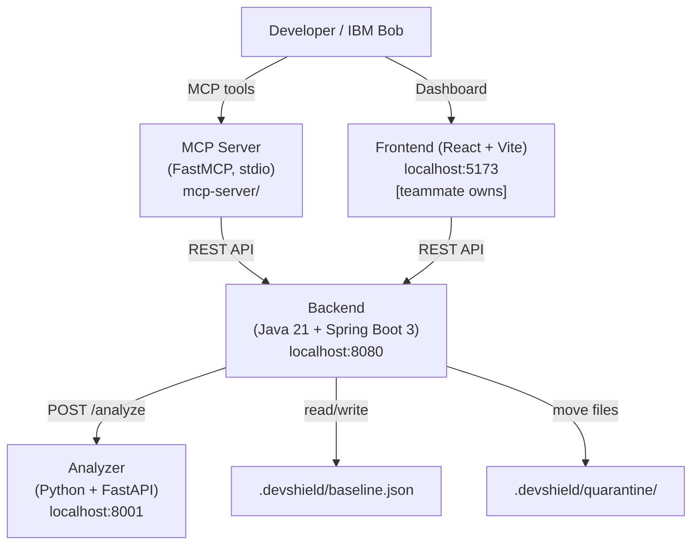
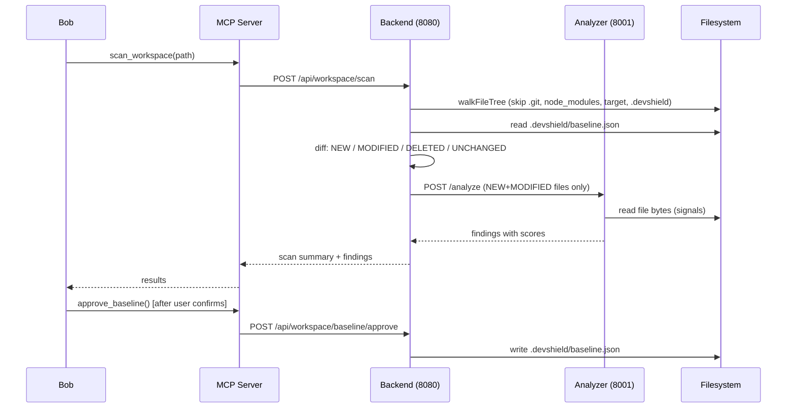

# DevShield

> **Nothing enters your build that you haven't approved.**

DevShield is an IBM Bob–driven pre-build gate for software supply-chain risk. It keeps an approved baseline of your workspace, detects everything that entered since, scores it with deterministic security signals, and has Bob's subagents review dependency and configuration changes before anything reaches your build or deployment.

---

## Problem

Projects constantly absorb things developers didn't write: new dependencies, install scripts, downloaded archives, generated files, binaries, config changes. Supply-chain attacks exploit this — malicious install scripts, dependencies from untrusted URLs, disguised binaries. Checking all of this manually before a build is slow and error-prone, so it rarely happens.

`git diff` shows that a file *changed*, not whether it is *risky*. Existing tools each check one narrow thing (secrets, known CVEs, AV signatures). Nothing answers: **"What entered my workspace since I last trusted it, and is any of it dangerous?"**

## Solution

DevShield answers that question with three ideas:

1. **Approved baseline** — When a developer approves a scan, DevShield records the workspace state (path, size, modified time, SHA-256 per file) as the trusted baseline, like a lockfile for the whole workspace.
2. **Incremental analysis** — Every later scan analyzes *only* files that are NEW or MODIFIED since the baseline. Unchanged files are skipped entirely — fast, focused, no noise.
3. **Bob as the front door** — DevShield does deterministic work (indexing, hashing, diffing, scoring). Bob does the reasoning: reading manifests and configs, correlating findings, explaining risk, guiding the decision.

---

## Architecture



### Services

| Service | Stack | Port |
|---------|-------|------|
| Backend | Java 21 + Spring Boot 3 (Maven) | 8080 |
| Analyzer | Python 3.11+ + FastAPI | 8001 |
| MCP Server | Python + FastMCP (stdio transport) | — |
| Frontend | React + Vite | 5173 |

### Data flow



---

## Security Signals

| Signal | Weight | Description |
|--------|--------|-------------|
| `known_bad_hash` | +100 | SHA-256 matches local blocklist |
| `magic_mismatch` | +35 | PE header inside a `.png`, etc. |
| `install_script` | +30 | `postinstall` in `package.json`; risky `setup.py` hooks |
| `double_extension` | +25 | `invoice.pdf.exe` pattern |
| `non_registry_dependency` | +25 | `git+`, tarball URL, or `file:` in dep files |
| `binary_in_source_dir` | +20 | `.exe`/`.dll`/`.so` in `src/`, `lib/`, `app/`, `uploads/` |
| `obfuscated_code` | +20 | `eval(atob(...))` or large base64 blob in JS/Python |
| `hidden_file_unusual_location` | +10 | Dot file outside expected dot directories |

Score capped at 100. Thresholds: **0–29 LOW → ALLOW**, **30–69 MEDIUM → REVIEW**, **70+ HIGH → QUARANTINE_REVIEW**.

---

## How IBM Bob Is Used

### 1. MCP Tools (`mcp-server/server.py`)

Register DevShield as a Bob MCP server to give Bob direct access to all scan operations:

| Tool | Description |
|------|-------------|
| `scan_workspace(workspace_path)` | Scan and diff against baseline |
| `get_findings(min_risk?)` | Get scored findings, optionally filtered |
| `get_file_details(file_id)` | Full signal detail for one file |
| `search_files(query)` | Search files by path fragment |
| `quarantine_file(file_id, confirmed)` | Move to quarantine — **requires confirmed=true** |
| `approve_baseline()` | Seal new baseline — **requires explicit user confirmation** |

**Register in Bob (Windows):**
```json
{
  "mcpServers": {
    "devshield": {
      "command": "C:\\Users\\soury\\OneDrive\\DevShield\\mcp-server\\.venv\\Scripts\\python.exe",
      "args": [
        "C:\\Users\\soury\\OneDrive\\DevShield\\mcp-server\\server.py"
      ],
      "transport": "stdio"
    }
  }
}
```

### 2. DevShield Gate — Custom Mode (`.bob/custom_modes.yaml`)

Switch to the **DevShield Gate** mode before a build or deploy. It:
- Automatically calls `scan_workspace` on session start
- Launches three parallel subagents: dependency reviewer, config/CI reviewer, findings explainer
- Merges results into `DEVSHIELD_REPORT.md`
- Never executes workspace files
- Never quarantines or approves baseline without explicit user confirmation
- Labels all output as AI-assisted risk assessment

### 3. Skill: `pre-build-supply-chain-check` (`.bob/skills/`)

Invoke with `/pre-build-supply-chain-check` or describe "check supply chain before build". The skill guides Bob through the full 5-step workflow: scan → baseline approval → fixture planting → incremental scan → report writing.

### 4. Parallel Subagents

The Gate mode and skill use `spawn_subagent` to run three reviewers simultaneously:
- **Dependency reviewer** — examines `package.json`, `requirements.txt`, `pom.xml`; flags non-registry sources and install hooks
- **Config/CI reviewer** — examines `.yml`, `.env`, Dockerfile, CI workflows; flags new external downloads or execution
- **Findings explainer** — translates HIGH/MEDIUM DevShield signals into plain-language explanations with recommended actions

---

## How to Run

### Prerequisites

| Tool | Version | Notes |
|------|---------|-------|
| Java | 21+ | `java -version` |
| Maven | 3.9+ | `mvn -v` — or use `mvnw` wrapper in `backend/` |
| Python | 3.11+ | `python --version` |
| Git | any | `git --version` |

### Quick start

```powershell
# 1. Set up analyzer virtual environment (first time only)
cd analyzer
python -m venv .venv
.\.venv\Scripts\pip install -r requirements.txt
cd ..

# 2. Set up MCP server virtual environment (first time only)
cd mcp-server
python -m venv .venv
.\.venv\Scripts\pip install -r requirements.txt
cd ..

# 3. Start both services
.\scripts\run-all.ps1
```

Both services start in background processes. Logs are written to `logs/`.

| Service | URL |
|---------|-----|
| Backend | http://localhost:8080 |
| Analyzer | http://localhost:8001/docs |

### Manual start

```powershell
# Terminal 1 — Analyzer
cd analyzer
.\.venv\Scripts\python.exe -m uvicorn main:app --host 0.0.0.0 --port 8001

# Terminal 2 — Backend
cd backend
mvn spring-boot:run
```

### First scan

```powershell
# Scan a workspace
$ws = (Resolve-Path "demo-workspace").Path
Invoke-RestMethod -Uri "http://localhost:8080/api/workspace/scan" `
  -Method POST -Body "{`"workspacePath`":`"$ws`"}" -ContentType "application/json"

# Approve baseline
Invoke-RestMethod -Uri "http://localhost:8080/api/workspace/baseline/approve" `
  -Method POST -Body "{}" -ContentType "application/json"
```

### Run evaluation

```powershell
# Full evaluation cycle: initial scan -> baseline -> plant fixtures -> incremental scan -> report
analyzer\.venv\Scripts\python.exe analyzer\evaluate.py demo-workspace
# Results written to docs/RESULTS.md
```

### Install pre-push hook

```powershell
.\scripts\install-hooks.ps1
# The hook blocks git push when HIGH findings are unresolved.
# Bypass: git push --no-verify
```

### Run tests

```powershell
# Backend (JUnit)
cd backend; mvn test

# Analyzer (pytest)
cd analyzer; .\.venv\Scripts\python.exe -m pytest tests/ -v
```

---

## Evaluation Results

From a live run against `demo-workspace` (19 files, 8 fixtures planted):

| Metric | Value |
|--------|-------|
| Initial scan duration | 27 ms |
| Initial files analyzed | 11 / 11 |
| Incremental scan duration | 15 ms |
| Incremental files analyzed | **9 / 19** |
| Files skipped (UNCHANGED) | **10** |
| Fixtures planted | 8 |
| Detected | **8 / 8 (100%)** |
| Missed | 0 |
| False positives | 0 |

**Key result:** The incremental scan analyzed only 9 of 19 files — the 10 baseline files were trusted and skipped entirely. See [`docs/RESULTS.md`](docs/RESULTS.md) for full signal-by-signal breakdown.

---

## Safety Principles

- **Never execute scanned files.** DevShield reads bytes only — no execution, no import, no eval of workspace content.
- **Never delete automatically.** Quarantine moves files to `.devshield/quarantine/` with a manifest (original path, hash, reason, timestamp). It is always restorable.
- **Quarantine requires explicit confirmation.** `POST /api/files/{id}/quarantine` returns 400 unless `{"confirmed": true}` is in the body. The MCP tool and Bob mode both enforce this.
- **Baseline approval requires explicit confirmation.** Bob's `approve_baseline` tool description and the DevShield Gate mode both demand the developer say yes before calling the endpoint.
- **Safe synthetic fixtures only.** No real malware in the repo — all fixtures are crafted bytes that trigger signals without being executable payloads.
- **No credentials in the repo.** No API keys, tokens, or passwords anywhere.

---

## Project Structure

```
DevShield/
  backend/                  Java 21 + Spring Boot 3 — REST API, indexer, scan service
  analyzer/                 Python + FastAPI — 8 security signal functions
  mcp-server/               FastMCP stdio server — wraps backend for Bob
  fixtures/                 Safe synthetic test artifact generator
  demo-workspace/           Sample project for integration testing
  scripts/
    run-all.ps1             Start analyzer + backend
    pre-push                Git pre-push hook (blocks HIGH findings)
    install-hooks.ps1       Install the pre-push hook
  .bob/
    custom_modes.yaml       DevShield Gate mode
    skills/
      pre-build-supply-chain-check/SKILL.md
  docs/
    BRIEF.md                Project brief
    RESULTS.md              Evaluation results (real measured numbers)
    PROGRESS.md             Build log
  CONTRACTS.md              Service interface contracts (do not modify)
```
